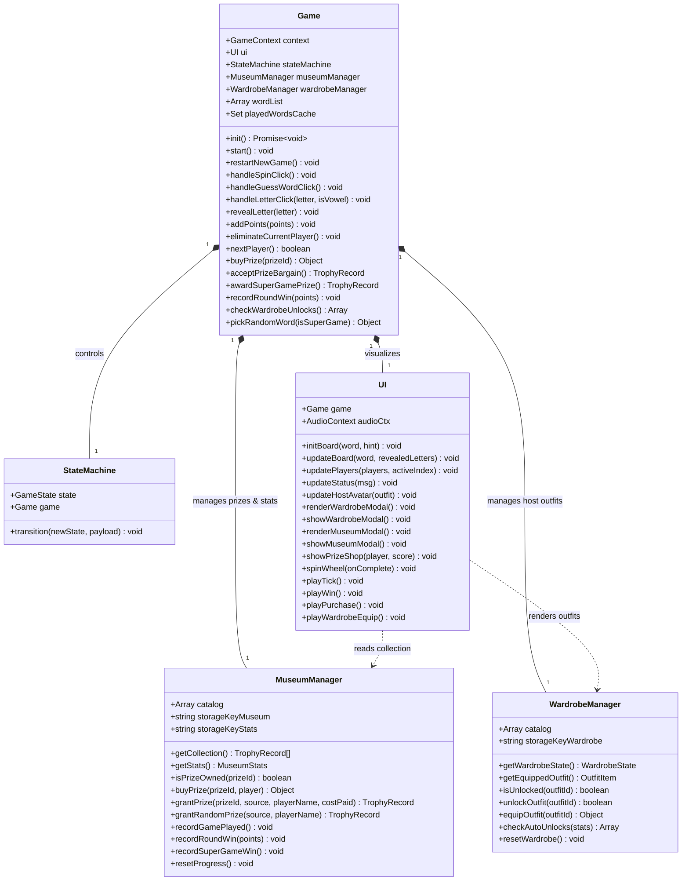
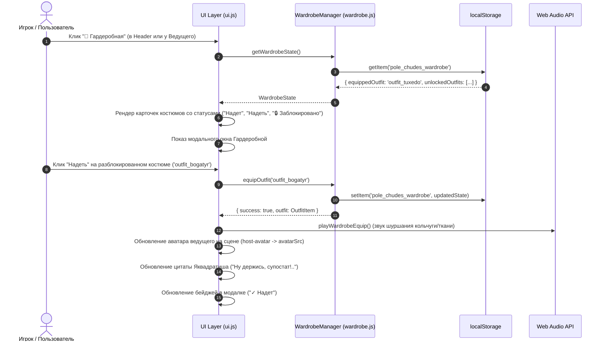
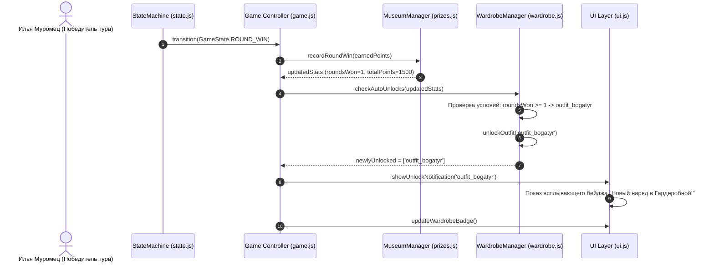

# System Design: Капитал-шоу "Поле Чудес: Premium Edition"
**Version:** v9.0.0 (Clean Room Rebranding, Three Bogatyrs, Yakvadratish Wardrobe Edition & Google Cloud Run Architecture)  
**Mode:** Compact Mode (Hot-Seat Multiplayer + Persistent Meta-Progression + Wardrobe Customization + Cloud Native)  
**Author:** System Architect (MetaGPT Pipeline)  
**Target Platform:** Pure HTML5 / CSS3 / ES6+ Modules + Google Cloud Run (Containerized Nginx Alpine)  

---

## 1. Implementation Approach & Architectural Philosophy

Проект реализуется в формате **Clean Room Enterprise SPA & Cloud Native Micro-Service**. Приложение полностью функционирует на стороне клиента (Client-Side Only) в браузере, а для высокопроизводительной доставки статических ресурсов и бессерверного масштабирования упаковано в легковесный Docker-контейнер на базе Nginx Alpine.

### 1.1 Архитектурные столпы релиза v9.0.0

```
+---------------------------------------------------------------------------------------+
|                                    Google Cloud Run                                   |
|  +---------------------------------------------------------------------------------+  |
|  |                  Nginx Alpine Web Server (Dynamic $PORT via envsubst)           |  |
|  |  - Gzip Compression     - ES6 MIME Types     - Security Headers                 |  |
|  |  - SPA Routing Fallback - /healthz Endpoint  - Static Caching Strategy          |  |
|  +---------------------------------------------------------------------------------+  |
+-------------------------------------------+-------------------------------------------+
                                            | (HTTP/2, HTTPS)
                                            v
+---------------------------------------------------------------------------------------+
|                                  Browser Client (SPA)                                 |
|                                                                                       |
|  +--------------------------------+   +---------------------------------------------+ |
|  |       Presentation Layer       |   |              Core Game Engine               | |
|  |  - Glassmorphism UI (ui.js)    |   |  - Game Controller (game.js)                | |
|  |  - Web Audio API Sound Synthesizer |  - State Machine (state.js, 20 States)      | |
|  |  - Wardrobe Modal & Avatar Host|   |  - Dictionary & Round Cache Engine          | |
|  |  - Trophy Museum & Prize Shop  |   +---------------------------------------------+ |
|  +--------------------------------+                          ^                        |
|                  ^                                           |                        |
|                  +---------------------+---------------------+                        |
|                                        v                                              |
|  +---------------------------------------------------------------------------------+  |
|  |                      Persistent Meta-Progression Services                       |  |
|  |  - MuseumManager (prizes.js): 16 Folklore Prizes, Stats, Trophy Collection      |  |
|  |  - WardrobeManager (wardrobe.js): 5 Yakvadratish Outfits, Auto-Unlocks, Outfits |  |
|  |  - LocalStorage Engine: 'pole_chudes_museum', 'pole_chudes_wardrobe', etc.      |  |
|  +---------------------------------------------------------------------------------+  |
+---------------------------------------------------------------------------------------+
```

1. **100% Legal Clean Room IP:**
   - Полная замена ведущего на оригинального колоритного персонажа: **Леонид Яквадратиш** — харизматичный усатый шоумен в смокинге с искрометным народным юмором.
   - Замена участников первой тройки на богатырей из славянского эпоса (Public Domain): **Илья Муромец** (Старший богатырь), **Добрыня Никитич** (Богатырь-дипломат), **Алёша Попович** (Младший богатырь).
   - Полная зачистка всех устаревших копирайт-ссылок (*"Harry", "Hermione", "Ron", "Якубович", "VID", "Dendy", "Funai", "Рубин"*).

2. **Yakvadratish Wardrobe Engine (`WardrobeManager`):**
   - Выделенный изолированный сервис управления гардеробом ведущего с каталогом из 5 аутентичных костюмов.
   - Механизм авторазблокировки по игровым триггерам (победа в 1 туре, сбор 4 экспонатов в Музее, накопление 7500 очков, победа в Супер-игре).
   - Реактивная смена аватара ведущего на сцене, в карточке ведущего и модальных окнах без перезагрузки страницы.
   - Персистентное хранение состояния в `localStorage` (`pole_chudes_wardrobe`).

3. **Фольклорно-былинный каталог призов (`MuseumManager`):**
   - 16 колоритных предметов славянского фольклора и ретро-традиций с 4 градациями ценности (`common`, `rare`, `epic`, `legendary`) от банки соленых рыжиков до коня Бурушки и Ковра-самолета.
   - Безопасное хранение трофеев и мета-статистики игрока в `localStorage` (`pole_chudes_museum`, `pole_chudes_stats`).

4. **Google Cloud Run Readiness & Containerization:**
   - Легковесный промышленный образ `Dockerfile` на базе `nginx:alpine` (< 30 МБ).
   - Поддержка динамического порта `$PORT` через шаблонизатор `nginx.conf.template` и стандартный `docker-entrypoint.d/20-envsubst-on-templates.sh`.
   - Эндпоинт проверки здоровья `/healthz` (`HTTP 200 OK` с телом `{"status":"healthy","version":"v9.0.0"}`).
   - Gzip-сжатие, строгие MIME-типы для ES6-модулей (`application/javascript`), SPA-fallback и защитные HTTP-заголовки.

---

## 2. Data Structures & Interface Definitions (TypeScript / ES6)

```typescript
// ========================================================
// 1. Общие типы редкости и источников
// ========================================================
export type RarityType = 'common' | 'rare' | 'epic' | 'legendary';

export type PrizeCategory = 
    | 'Памятное'
    | 'Угощения'
    | 'Посуда'
    | 'Традиции'
    | 'Музыка'
    | 'Уют'
    | 'Артефакты'
    | 'Вооружение'
    | 'Престиж'
    | 'Транспорт'
    | 'Зал Славы';

export type PrizeSource = 'shop' | 'prize_sector' | 'super_game';

// ========================================================
// 2. Структуры Каталога Призов (Folklore & Retro)
// ========================================================
export interface PrizeItem {
    id: string;               // Уникальный ID ('prize_pickles', 'prize_horse')
    name: string;             // Отображаемое былинное название
    rarity: RarityType;       // Градация ценности
    price: number;            // Стоимость в очках (0 для памятного подарка)
    icon: string;             // Символ/эмодзи экспоната ('🍄', '🐎', '🪕')
    description: string;      // Атмосферное описание
    category: PrizeCategory;  // Категория экспоната
    sourcePool: PrizeSource[];// Допустимые способы получения
}

export interface TrophyRecord {
    id: string;               // UUID записи (`${prizeId}_${timestamp}`)
    prizeId: string;          // Внешний ключ на PrizeItem.id
    unlockedAt: string;       // ISO дата получения
    costPaid: number;         // Уплаченные очки
    source: PrizeSource;      // Источник получения
    playerName: string;       // Имя богатыря, добавившего экспонат
}

export interface MuseumStats {
    gamesPlayed: number;        // Всего сыграно игр
    roundsWon: number;          // Побед в основных турах
    superGameWins: number;      // Побед в супер-играх
    totalPointsEarned: number;  // Суммарно набрано очков за историю профиля
    prizesCollected: number;    // Количество уникальных собранных экспонатов
}

// ========================================================
// 3. Структуры Гардеробной Леонида Яквадратиша
// ========================================================
export type UnlockConditionType = 
    | 'default'          // Доступен сразу
    | 'round_win'        // Победа в туре (>= count)
    | 'museum_count'     // Количество экспонатов в Музее (>= count)
    | 'total_points'     // Суммарно очков (>= points)
    | 'super_game_win';  // Победа в Супер-игре (>= count)

export interface OutfitItem {
    id: string;                      // 'outfit_tuxedo', 'outfit_bogatyr', etc.
    name: string;                    // Название наряда
    rarity: RarityType;              // Редкость
    icon: string;                    // Эмодзи костюма ('🤵', '🛡️', '👑', '🪔', '🧑‍🚀')
    unlockConditionText: string;     // Текстовое описание условия открытия для UI
    unlockType: UnlockConditionType; // Тип программного триггера
    unlockThreshold: number;         // Пороговое значение для авторазблокировки
    avatarSrc: string;               // Путь к изображению аватара
    quote: string;                   // Реплика Яквадратиша при примерке
    description: string;             // Художественное описание наряда
}

export interface WardrobeState {
    equippedOutfit: string;          // ID текущего надетого костюма
    unlockedOutfits: string[];       // Массив ID разблокированных костюмов
}

// ========================================================
// 4. Стейт-машина и раунд (20 Состояний)
// ========================================================
export enum GameState {
    INIT = 'INIT',
    NEXT_PLAYER_ANNOUNCE = 'NEXT_PLAYER_ANNOUNCE',
    WAITING_FOR_SPIN = 'WAITING_FOR_SPIN',
    SPINNING = 'SPINNING',
    EVALUATE_SECTOR = 'EVALUATE_SECTOR',
    WAITING_FOR_LETTER = 'WAITING_FOR_LETTER',
    WAITING_FOR_CELL = 'WAITING_FOR_CELL',
    PRIZE_BARGAIN = 'PRIZE_BARGAIN',
    GUESSING_WORD = 'GUESSING_WORD',
    CHECK_MATCH = 'CHECK_MATCH',
    PASSING_TURN = 'PASSING_TURN',
    CHECK_WIN = 'CHECK_WIN',
    ROUND_WIN = 'ROUND_WIN',
    CASKET_GAME = 'CASKET_GAME',
    SUPER_GAME_OFFER = 'SUPER_GAME_OFFER',
    SUPER_GAME_SETUP = 'SUPER_GAME_SETUP',
    SUPER_GAME_PLAYING = 'SUPER_GAME_PLAYING',
    SUPER_GAME_WIN = 'SUPER_GAME_WIN',
    PRIZE_SHOP = 'PRIZE_SHOP',
    GAME_OVER = 'GAME_OVER'
}

export enum SectorType {
    POINTS = 'POINTS',
    BANKRUPT = 'BANKRUPT',
    ZERO = 'ZERO',
    PLUS = 'PLUS',
    PRIZE = 'PRIZE'
}

export interface Player {
    id: number;
    name: string;       // 'Илья Муромец', 'Добрыня Никитич', 'Алёша Попович'
    title: string;      // 'Старший богатырь', 'Богатырь-дипломат', 'Младший богатырь'
    avatar: string;     // Путь к былинному аватару
    score: number;      // Очки текущего раунда
    isEliminated: boolean;
}

export interface GameContext {
    players: Player[];
    activePlayerIndex: number;
    secretWord: string;
    hint: string;
    revealedLetters: Set<string>;
    currentSectorValue: string | number;
    consecutiveGuesses: number;
    isSuperGame: boolean;
    superGameSetupLettersLeft: number;
    superGameTimer: ReturnType<typeof setInterval> | null;
    playedWordsCache: Set<string>;
}

// ========================================================
// 5. Интерфейсы Менеджеров (Museum & Wardrobe)
// ========================================================
export interface IMuseumManager {
    readonly catalog: PrizeItem[];
    getCollection(): TrophyRecord[];
    getStats(): MuseumStats;
    isPrizeOwned(prizeId: string): boolean;
    buyPrize(prizeId: string, player: Player): { success: boolean; error?: string; trophy?: TrophyRecord };
    grantPrize(prizeId: string, source: PrizeSource, playerName: string, costPaid?: number): TrophyRecord;
    grantRandomPrize(source: PrizeSource, playerName: string): TrophyRecord;
    recordGamePlayed(): void;
    recordRoundWin(points: number): void;
    recordSuperGameWin(): void;
    resetProgress(): void;
}

export interface IWardrobeManager {
    readonly catalog: OutfitItem[];
    getWardrobeState(): WardrobeState;
    getEquippedOutfit(): OutfitItem;
    isUnlocked(outfitId: string): boolean;
    unlockOutfit(outfitId: string): boolean;
    equipOutfit(outfitId: string): { success: boolean; outfit?: OutfitItem; error?: string };
    checkAutoUnlocks(stats: MuseumStats): string[];
    resetWardrobe(): void;
}
```

---

## 3. Catalogs Specification

### 3.1 Фольклорно-ретроспективный каталог призов (`PRIZES_CATALOG`)

Каталог состоит из 16 сбалансированных предметов без нарушений авторских прав:

| ID | Название | Редкость | Цена | Категория | Иконка | Описание |
|---|---|---|---|---|---|---|
| `prize_postcard` | Фирменная открытка от Яквадратиша | `common` | 0 | Памятное | ✉️ | Красочная открытка с теплой дарственной надписью и улыбкой Леонида Яквадратиша. |
| `prize_pickles` | Банка соленых рыжиков | `common` | 100 | Угощения | 🍄 | Хрустящие лесные рыжики в пряном рассоле с укропом и чесночком по старинному рецепту. |
| `prize_tea` | Пачка душистого иван-чая | `common` | 250 | Угощения | 🫖 | Отборный ферментированный кипрей с таежными ягодами. Богатырское здоровье в каждой чашке! |
| `prize_pryanik` | Тульский пряник-великан | `common` | 500 | Угощения | 🥮 | Печатный медовый пряник с яблочным повидлом весом в целый пуд! |
| `prize_glasses` | Набор хрустальных кубков | `rare` | 750 | Посуда | 🥂 | Звонкие граненые кубки для ключевой воды и праздничного кваса. |
| `prize_samovar` | Расписной электросамовар | `rare` | 1000 | Традиции | 🫖 | Золоченый тульский самовар с хохломской росписью. Душа любой богатырской беседы. |
| `prize_gusli` | Гусли-самогуды | `rare` | 1500 | Музыка | 🪕 | Звончатые яровчатые гусли: сами играют, сами плясать заставляют! |
| `prize_carpet` | Настенный ковер со сказочными оленями | `rare` | 2000 | Уют | 🧶 | Теплый шерстяной ковер с пушистым ворсом для богатырской опочивальни. |
| `prize_boots` | Сапоги-скороходы сафьяновые | `epic` | 2500 | Артефакты | 👢 | Сафьяновые сапоги на мягком ходу: шаг шагнул — семь верст отмерил! |
| `prize_feather` | Перо Жар-птицы сияющее | `epic` | 3500 | Артефакты | 🪶 | Волшебное перо, освещающее даже самую темную ночь ярче тысячи свечей. |
| `prize_tablecloth` | Скатерть-самобранка шелковая | `epic` | 5000 | Артефакты | 📜 | Стоит расстелить — и на столе яства сахарные, пироги пышные да напитки медвяные! |
| `prize_sword` | Меч-кладенец булатный | `epic` | 7000 | Вооружение | ⚔️ | Кованый булатный клинок работы древних мастеров, сокрушающий любые преграды. |
| `prize_fur_coat` | Соболья шуба до пят | `epic` | 9000 | Престиж | 🧥 | Бархатная шуба на отборных сибирских соболях. Подарок достойный великих князей! |
| `prize_horse` | Богатырский конь Бурушка | `legendary` | 15000 | Транспорт | 🐎 | Верный былинный скакун: из копыт искры сыплются, ветру в поле не угнаться! |
| `prize_carpet_plane` | Сказочный Ковер-самолет | `legendary` | 25000 | Транспорт | 🛸 | Роскошный ковер ручной вязки для беспосадочных полетов над тридевятым царством. |
| `prize_gold_cup` | Золотая Медаль Леонида Яквадратиша | `legendary` | 30000 | Зал Славы | 🏅 | Высшая награда Капитал-шоу из чистого золота для истинных чемпионов народной эрудиции. |

---

### 3.2 Каталог Гардеробной Леонида Яквадратиша (`YAKVADRATISH_WARDROBE`)

| ID Костюма | Название наряда | Иконка | Редкость | Условие открытия (Trigger) | Цитата Леонида Яквадратиша |
|---|---|---|---|---|---|
| `outfit_tuxedo` | Классический смокинг | 🤵 | `common` | Доступен сразу (`default`) | *«Классика не стареет, господа эрудиты!»* |
| `outfit_bogatyr` | Богатырский шлем и кольчуга | 🛡️ | `rare` | Выиграть 1 тур (`round_win >= 1`) | *«Ну держись, супостат! С таким нарядом ни один сектор Банкрот не страшен!»* |
| `outfit_boyar` | Боярский кафтан и соболья шапка | 👑 | `rare` | Собрать 4 экспоната в Музее (`museum_count >= 4`) | *«Чувствую себя настоящим главой Посольского приказа!»* |
| `outfit_folk_robe` | Расшитый халат и тюбетейка | 🪔 | `epic` | Набрать 7500 очков (`total_points >= 7500`) | *«Чай, сладости и восточное гостеприимство прямо в нашей студии!»* |
| `outfit_cosmonaut` | Шлем космонавта | 🧑‍🚀 | `legendary` | Победить в Супер-игре (`super_game_win >= 1`) | *«Поехали! Капитал-шоу выходит на космическую орбиту!»* |

---

## 4. Google Cloud Run Deployment & Container Architecture

### 4.1 Топология развертывания

```
                                 Google Cloud Platform
                        +---------------------------------------+
                        |           Google Cloud Run            |
                        |                                       |
    HTTPS User Traffic  |    +-----------------------------+    |
    ------------------->|--->|   Container: Nginx Alpine   |    |
    (Port 443 / SSL)    |    |   - Listening on $PORT      |    |
                        |    |   - Static SPA assets       |    |
                        |    |   - Gzip compression        |    |
                        |    |   - /healthz -> 200 OK      |    |
                        |    +-----------------------------+    |
                        +---------------------------------------+
```

### 4.2 Спецификация `Dockerfile`
Контейнер создается на базе минималистичного `nginx:alpine` с передачей статических файлов и шаблона виртуального хоста:

```dockerfile
# -------------------------------------------------------------
# Google Cloud Run Optimized Dockerfile
# Base: nginx:alpine (lightweight, secure, < 30MB)
# -------------------------------------------------------------
FROM nginx:alpine

# Set working directory for static assets
WORKDIR /usr/share/nginx/html

# Remove default nginx static assets
RUN rm -rf ./*

# Copy project static assets
COPY src/ .

# Copy Nginx template for dynamic $PORT substitution by envsubst
COPY nginx.conf.template /etc/nginx/templates/default.conf.template

# Default fallback PORT if not provided by Cloud Run
ENV PORT=8080

# Expose standard Cloud Run port
EXPOSE 8080

# Health check instruction for local docker verification
HEALTHCHECK --interval=30s --timeout=3s --start-period=2s --retries=3 \
  CMD wget --quiet --tries=1 --spider http://127.0.0.1:${PORT}/healthz || exit 1

# Standard Nginx startup (envsubst runs automatically on /etc/nginx/templates/*.template)
CMD ["nginx", "-g", "daemon off;"]
```

### 4.3 Спецификация `nginx.conf.template`
Конфигурация включает автоматическую подстановку `${PORT}`, сжатие Gzip, строгие MIME-типы для ES6-модулей, защитные HTTP-заголовки и эндпоинт `/healthz`:

```nginx
server {
    listen ${PORT};
    server_name localhost;

    root /usr/share/nginx/html;
    index index.html;

    # ---------------------------------------------------------
    # Gzip Compression Optimization
    # ---------------------------------------------------------
    gzip on;
    gzip_vary on;
    gzip_min_length 256;
    gzip_proxied any;
    gzip_types
        text/plain
        text/css
        text/javascript
        application/javascript
        application/json
        application/xml
        image/svg+xml;

    # ---------------------------------------------------------
    # Security Headers
    # ---------------------------------------------------------
    add_header X-Frame-Options "SAMEORIGIN" always;
    add_header X-Content-Type-Options "nosniff" always;
    add_header X-XSS-Protection "1; mode=block" always;
    add_header Referrer-Policy "strict-origin-when-cross-origin" always;

    # ---------------------------------------------------------
    # Healthcheck Endpoint for Cloud Run Probes
    # ---------------------------------------------------------
    location = /healthz {
        access_log off;
        default_type application/json;
        return 200 '{"status":"healthy","version":"v9.0.0"}';
    }

    # ---------------------------------------------------------
    # Static Assets Caching & Correct MIME types for ES6 modules
    # ---------------------------------------------------------
    location ~* \.(js|mjs)$ {
        types {
            application/javascript js mjs;
        }
        add_header Content-Type application/javascript;
        add_header Cache-Control "public, max-age=31536000, immutable";
        try_files $uri =404;
    }

    location ~* \.(css|png|jpg|jpeg|gif|svg|ico|json)$ {
        add_header Cache-Control "public, max-age=31536000, immutable";
        try_files $uri =404;
    }

    # ---------------------------------------------------------
    # SPA Fallback for index.html (No-Cache for Entry Point)
    # ---------------------------------------------------------
    location / {
        add_header Cache-Control "no-cache, no-store, must-revalidate";
        try_files $uri $uri/ /index.html;
    }
}
```

---

## 5. Class Diagram (Mermaid)



---

## 6. Sequence Diagrams

### 6.1 Yakvadratish Wardrobe Customization Flow



---

### 6.2 Google Cloud Run Startup & Health Probe Execution

```mermaid
sequenceDiagram
    autonumber
    participant CloudRun as Google Cloud Run Fabric
    participant Entrypoint as Container Entrypoint (envsubst)
    participant Nginx as Nginx Alpine Daemon
    participant Probe as Cloud Run Health Checker
    actor User as Браузер пользователя

    CloudRun->>Entrypoint: Запуск контейнера (передача ENV: PORT=8080)
    Entrypoint->>Entrypoint: envsubst < default.conf.template > default.conf
    Entrypoint->>Nginx: nginx -g "daemon off;"
    Nginx-->>CloudRun: Порт 8080 открыт и слушает входящие соединения

    CloudRun->>Probe: Выполнение Health Check
    Probe->>Nginx: GET http://localhost:8080/healthz
    Nginx-->>Probe: HTTP 200 OK {"status":"healthy","version":"v9.0.0"}
    Probe-->>CloudRun: Revision Status: READY (100% Traffic Allowed)

    User->>Nginx: HTTPS GET / (Запрос веб-игры)
    Nginx-->>User: HTTP 200 (index.html, JS Modules, CSS, Dictionary, Assets)
```

---

### 6.3 Auto-Unlock Costumes upon Round Win & Meta-Progression



---

## 7. Strict File List & Change Plan

| Файл | Назначение | Характер изменений в v9.0.0 |
|---|---|---|
| [`Dockerfile`](file:///workspaces/antigravity20/5_MetaGPT/projects/pole_chudes_capital/Dockerfile) | Сборка контейнера Cloud Run | **Новый файл:** `nginx:alpine`, поддержка `$PORT`, статика, healthcheck. |
| [`nginx.conf.template`](file:///workspaces/antigravity20/5_MetaGPT/projects/pole_chudes_capital/nginx.conf.template) | Шаблон веб-сервера Nginx | **Новый файл:** `${PORT}` envsubst, `/healthz` 200 OK JSON, Gzip, MIME types, SPA. |
| [`.dockerignore`](file:///workspaces/antigravity20/5_MetaGPT/projects/pole_chudes_capital/.dockerignore) | Исключения сборки Docker | **Новый файл:** Исключение `node_modules`, `tests`, `docs`, `git`. |
| [`src/index.html`](file:///workspaces/antigravity20/5_MetaGPT/projects/pole_chudes_capital/src/index.html) | Главная страница | Ребрендинг Яквадратиша, Три Богатыря, модальное окно Гардеробной, кнопка `👔` в Header, скрипты `?v=9.0.0`. |
| [`src/style.css`](file:///workspaces/antigravity20/5_MetaGPT/projects/pole_chudes_capital/src/style.css) | Стили Glassmorphism | Стили для сетки Гардеробной, карточек костюмов, анимаций примерки, бейджей редкости. |
| [`src/js/wardrobe.js`](file:///workspaces/antigravity20/5_MetaGPT/projects/pole_chudes_capital/src/js/wardrobe.js) | Движок Гардеробной | **Новый модуль:** Каталог `YAKVADRATISH_WARDROBE`, класс `WardrobeManager`, авторазблокировка, персистентность. |
| [`src/js/prizes.js`](file:///workspaces/antigravity20/5_MetaGPT/projects/pole_chudes_capital/src/js/prizes.js) | Каталог призов и Музей | Обновление `PRIZES_CATALOG` на 16 фольклорных призов, 100% Clean Room IP. |
| [`src/js/game.js`](file:///workspaces/antigravity20/5_MetaGPT/projects/pole_chudes_capital/src/js/game.js) | Ядро игры | Инициализация Трёх Богатырей, подключение `WardrobeManager`, проверка авторазблокировок. |
| [`src/js/state.js`](file:///workspaces/antigravity20/5_MetaGPT/projects/pole_chudes_capital/src/js/state.js) | Конечный автомат | Замена реплик на реплики Леонида Яквадратиша, Clean Room IP. |
| [`src/js/ui.js`](file:///workspaces/antigravity20/5_MetaGPT/projects/pole_chudes_capital/src/js/ui.js) | Слой представления | Рендеринг Гардеробной, динамическое обновление аватара ведущего, звук `playWardrobeEquip()`. |
| [`src/js/main.js`](file:///workspaces/antigravity20/5_MetaGPT/projects/pole_chudes_capital/src/js/main.js) | Точка входа | Биндинг кнопки Гардеробной `👔`, инициализация `?v=9.0.0`. |
| [`tests/game.test.js`](file:///workspaces/antigravity20/5_MetaGPT/projects/pole_chudes_capital/tests/game.test.js) | Unit-тесты Node.js | Тесты 16 фольклорных призов, 5 костюмов гардероба, авторазблокировки и Трёх Богатырей. |
| [`tests/e2e_browser_test.py`](file:///workspaces/antigravity20/5_MetaGPT/projects/pole_chudes_capital/tests/e2e_browser_test.py) | E2E Marionette тесты | E2E верификация гардероба, смены аватара, открытия Музея и первого кадра игры. |

---

## 8. Implementation Roadmap

```
                                  v9.0.0 Implementation Timeline
  +-----------------------------------------------------------------------------------------------+
  | Phase 1: Clean Room Rebranding & Folklore Catalog (prizes.js, game.js, state.js, index.html)  |
  +-----------------------------------------------------------------------------------------------+
                                                 |
                                                 v
  +-----------------------------------------------------------------------------------------------+
  | Phase 2: Yakvadratish Wardrobe Engine (wardrobe.js, ui.js, style.css, index.html)            |
  +-----------------------------------------------------------------------------------------------+
                                                 |
                                                 v
  +-----------------------------------------------------------------------------------------------+
  | Phase 3: Cloud Run Container Infrastructure (Dockerfile, nginx.conf.template, .dockerignore)  |
  +-----------------------------------------------------------------------------------------------+
                                                 |
                                                 v
  +-----------------------------------------------------------------------------------------------+
  | Phase 4: Full QA Verification (Unit Tests, E2E Browser Test, Local Docker Health Check)       |
  +-----------------------------------------------------------------------------------------------+
```

1. **Этап 1: Clean Room IP & Былинный каталог:**
   - Обновить `prizes.js`: заменить каталог на 16 фольклорных призов.
   - Обновить состав игроков в `game.js`: Илья Муромец, Добрыня Никитич, Алёша Попович.
   - Обновить реплики в `state.js` и заголовок в `index.html`.
2. **Этап 2: Движок Гардеробной Яквадратиша:**
   - Создать `src/js/wardrobe.js` с каталогом `YAKVADRATISH_WARDROBE` и классом `WardrobeManager`.
   - Внедрить модальное окно Гардеробной в `index.html` и стили в `style.css`.
   - Добавить методы рендеринга и примерки костюмов в `ui.js`.
   - Связать авторазблокировку костюмов в `game.js` при победе в туре / супер-игре.
3. **Этап 3: Google Cloud Run Infrastructure:**
   - Создать `Dockerfile` на базе `nginx:alpine` с `EXPOSE 8080`.
   - Создать `nginx.conf.template` с динамическим `${PORT}` и эндпоинтом `/healthz`.
   - Добавить `.dockerignore`.
4. **Этап 4: Тестирование и приемка:**
   - Обновить и запустить модульные тесты `npm test` (`tests/game.test.js`).
   - Прогнать E2E тестирование в браузере `python3 tests/e2e_browser_test.py`.
   - Проверить сборку Docker и отклик `/healthz`.

---
*Документ System Design v9.0.0 готов и передается на шлюз Gate 1B Review.*
