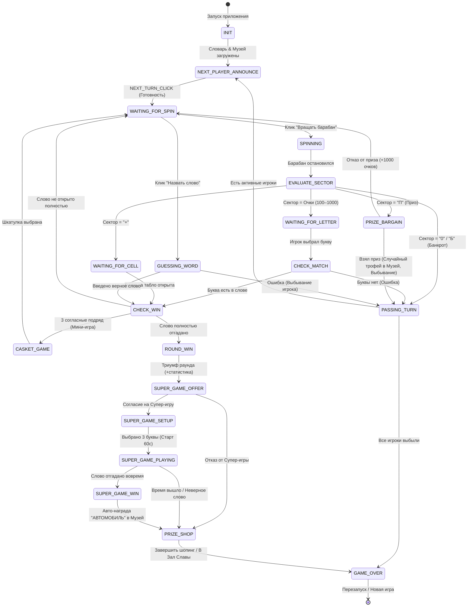
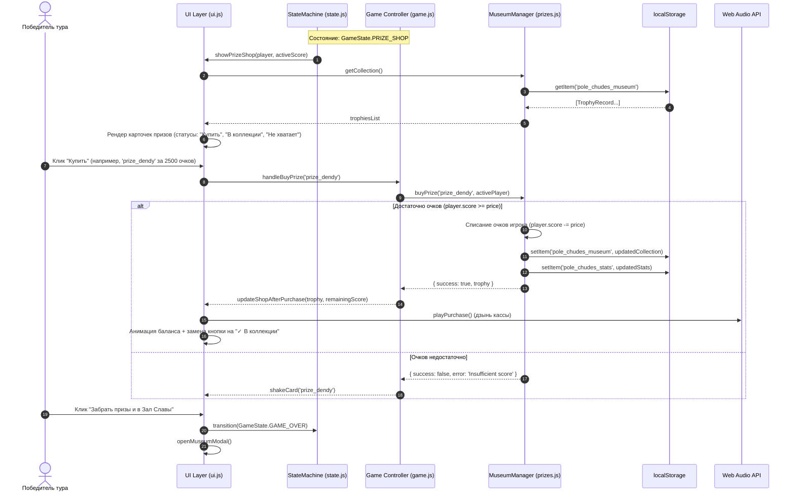
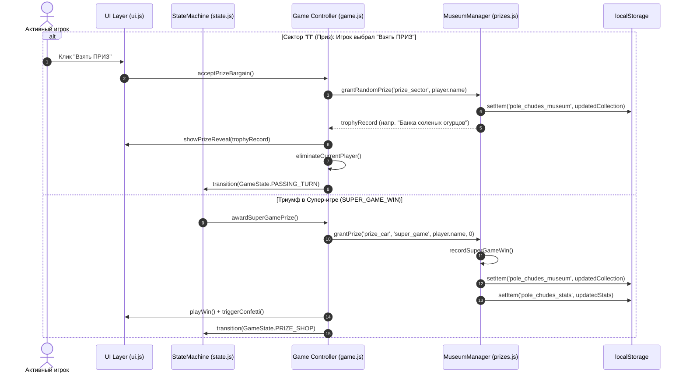

# System Design: Капитал-шоу "Поле Чудес: Premium Edition"

## 1. Implementation Approach
Проект реализуется в формате **Compact Mode (Hot-Seat Multiplayer + Persistent Meta-Progression)**.
Приложение полностью функционирует на стороне клиента (Client-Side Only) без выделенного бэкенда. Вся бизнес-логика, хранение коллекций и управление состояниями реализованы на **Pure HTML5, CSS3, JS ES6+ (Vanilla JS)** в виде модульной ES-архитектуры (`type="module"`).

### 1.1 Архитектурный подход для «Витрины подарков и Музея Капитал-шоу» (v8.0.0)
1. **Модуль каталога и персистентности (`prizes.js`):**
   - Выделен отдельный изолированный сервис `MuseumManager`, выступающий единым источником правды (Single Source of Truth) для каталога товаров, разблокированных трофеев и мета-статистики игрока.
   - Каталог включает 16 культовых призов телешоу с четкой иерархией редкостей (`common`, `rare`, `epic`, `legendary`), стоимостями, категориями и описаниями.
   - Хранилище использует браузерный `localStorage`:
     - `pole_chudes_museum` — массив записей трофеев `TrophyRecord[]`.
     - `pole_chudes_stats` — агрегированный объект мета-статистики `MuseumStats`.
     - `pole_chudes_cache` — кэш сыгранных слов раунда.
   - Все операции чтения/записи обернуты в безопасный слой `try/catch` с автоматической валидацией структуры и fallback-значениями по умолчанию при повреждении кэша.

2. **Интеграция со State Machine (`state.js`):**
   - Добавлены новые полноправные состояния жизненного цикла: `PRIZE_SHOP`, `SUPER_GAME_OFFER`, `SUPER_GAME_SETUP`, `SUPER_GAME_PLAYING`, `SUPER_GAME_WIN`.
   - Исключены любые состояния гонки (Race Conditions): доступ к Витрине подарков открывается строго после завершения раунда или супер-игры.
   - Сектор «Приз» (П): при согласии игрока взять приз генерируется случайный подарок из каталога с немедленной записью в Музей, после чего игрок помечается как `isEliminated = true`.

3. **Слой представления и Glassmorphism UI (`ui.js`, `style.css`, `index.html`):**
   - Реализованы два независимых модальных экрана в стиле Premium Glassmorphism (`backdrop-filter: blur(16px)`):
     - **Витрина подарков (Prize Shop Modal):** Интерактивная витрина товаров, динамический индикатор очков победителя, кнопки покупки с валидацией баланса, бейджи "В коллекции" и "Не хватает очков".
     - **Музей Капитал-шоу (Trophy Room Modal):** Постоянный Зал Славы, доступный по кнопке `🏛️ Музей` в Header в любой момент игры. Содержит дашборд статистики (игры, победы, супер-игры, очки, % коллекции), табы-фильтры по редкости (`Все`, `Обычные`, `Редкие`, `Эпические`, `Легендарные`), карточки открытых экспонатов и силуэты закрытых с замком 🔒.
   - Неоновые акцентные свечения редкостей: Common (серый/бронза), Rare (изумруд/бирюза), Epic (фиолетовый неон), Legendary (золотой ореол с анимацией пульсации).

4. **Аудио-движок (Web Audio API):**
   - Синтез звуков в реальном времени без внешних медиафайлов: `playTick()` (вращение барабана, открытие ячеек), `playWin()` (фанфары триумфа), `playPurchase()` (звук кассового аппарата / звенящей монеты при покупке на витрине).

---

## 2. Data Structures & Interface Definitions (TypeScript/ES6 notation)

```typescript
// ==========================================
// 1. Редкости, категории и источники призов
// ==========================================
export type RarityType = 'common' | 'rare' | 'epic' | 'legendary';

export type PrizeCategory = 
    | 'Памятное'
    | 'Продукты'
    | 'Бытовая техника'
    | 'Посуда'
    | 'Традиции'
    | 'Уют'
    | 'Развлечения'
    | 'Электроника'
    | 'Технологии'
    | 'Престиж'
    | 'Транспорт'
    | 'Недвижимость'
    | 'Зал Славы';

export type PrizeSource = 'shop' | 'prize_sector' | 'super_game';

// ==========================================
// 2. Каталог призов и трофеев
// ==========================================
export interface PrizeItem {
    id: string;               // Уникальный ключ (например, 'prize_pickles', 'prize_car')
    name: string;             // Отображаемое название
    rarity: RarityType;       // Градация ценности
    price: number;            // Стоимость в очках (0 для утешительного подарка)
    icon: string;             // Символ/эмодзи экспоната ('🥒', '🚗', '📺')
    description: string;      // Атмосферное юмористическое описание
    category: PrizeCategory;  // Категория экспоната
    sourcePool: PrizeSource[];// Допустимые способы получения
}

export interface TrophyRecord {
    id: string;               // UUID записи в музее (`${prizeId}_${timestamp}`)
    prizeId: string;          // Внешний ключ на PrizeItem.id
    unlockedAt: string;       // ISO дата получения ('2026-08-14T20:00:00.000Z')
    costPaid: number;         // Фактически уплаченные очки (0 при подарке)
    source: PrizeSource;      // Источник ('shop' | 'prize_sector' | 'super_game')
    playerName: string;       // Имя победителя, добавившего экспонат
}

// ==========================================
// 3. Мета-статистика Музея
// ==========================================
export interface MuseumStats {
    gamesPlayed: number;        // Всего сыграно игр
    roundsWon: number;          // Побед в основных турах
    superGameWins: number;      // Побед в супер-играх
    totalPointsEarned: number;  // Суммарно набрано очков за историю профиля
    prizesCollected: number;    // Количество уникальных собранных экспонатов
}

// ==========================================
// 4. Стейт-машина и раунд
// ==========================================
export enum GameState {
    INIT = 'INIT',
    NEXT_PLAYER_ANNOUNCE = 'NEXT_PLAYER_ANNOUNCE',
    WAITING_FOR_SPIN = 'WAITING_FOR_SPIN',
    SPINNING = 'SPINNING',
    EVALUATE_SECTOR = 'EVALUATE_SECTOR',
    WAITING_FOR_LETTER = 'WAITING_FOR_LETTER',
    WAITING_FOR_CELL = 'WAITING_FOR_CELL',
    PRIZE_BARGAIN = 'PRIZE_BARGAIN',
    GUESSING_WORD = 'GUESSING_WORD',
    CHECK_MATCH = 'CHECK_MATCH',
    PASSING_TURN = 'PASSING_TURN',
    CHECK_WIN = 'CHECK_WIN',
    ROUND_WIN = 'ROUND_WIN',
    CASKET_GAME = 'CASKET_GAME',
    SUPER_GAME_OFFER = 'SUPER_GAME_OFFER',
    SUPER_GAME_SETUP = 'SUPER_GAME_SETUP',
    SUPER_GAME_PLAYING = 'SUPER_GAME_PLAYING',
    SUPER_GAME_WIN = 'SUPER_GAME_WIN',
    PRIZE_SHOP = 'PRIZE_SHOP',
    GAME_OVER = 'GAME_OVER'
}

export enum SectorType {
    POINTS = 'POINTS',
    BANKRUPT = 'BANKRUPT',
    ZERO = 'ZERO',
    PLUS = 'PLUS',
    PRIZE = 'PRIZE'
}

export interface Player {
    id: number;
    name: string;
    avatar: string;
    score: number;
    isEliminated: boolean;
}

export type WordCategoryType = 'Животные' | 'Природа' | 'Сказки' | 'Изобретения' | 'Космос';

export interface WordData {
    word: string;               // Загаданное слово (UPPERCASE)
    hint: string;               // Подсказка/факт Ведущего
    category: WordCategoryType; // Категория слова
    difficulty: 1 | 2;          // Сложность
    superGame: boolean;         // Подходит ли для супер-игры
}

export interface GameContext {
    players: Player[];
    activePlayerIndex: number;
    secretWord: string;
    hint: string;
    revealedLetters: Set<string>;
    currentSectorValue: string | number;
    consecutiveGuesses: number;
    isSuperGame: boolean;
    superGameSetupLettersLeft: number;
    superGameTimer: ReturnType<typeof setInterval> | null;
    playedWordsCache: Set<string>;
}

// ==========================================
// 5. Интерфейс менеджера Музея и Призов
// ==========================================
export interface IMuseumManager {
    readonly catalog: PrizeItem[];
    getCollection(): TrophyRecord[];
    getStats(): MuseumStats;
    isPrizeOwned(prizeId: string): boolean;
    buyPrize(prizeId: string, player: Player): { success: boolean; error?: string; trophy?: TrophyRecord };
    grantPrize(prizeId: string, source: PrizeSource, playerName: string, costPaid?: number): TrophyRecord;
    grantRandomPrize(source: PrizeSource, playerName: string): TrophyRecord;
    recordGamePlayed(): void;
    recordRoundWin(points: number): void;
    recordSuperGameWin(): void;
    resetProgress(): void;
}
```

### 2.1 Каталог 16 призов телешоу (`PRIZES_CATALOG`)
Каталог зафиксирован в [`src/js/prizes.js`](file:///workspaces/antigravity20/5_MetaGPT/projects/pole_chudes_capital/src/js/prizes.js):

| ID | Название | Редкость | Цена | Категория | Иконка |
|---|---|---|---|---|---|
| `prize_postcard` | Открытка с автографом Якубовича | `common` | 0 | Памятное | ✉️ |
| `prize_pickles` | Банка соленых огурцов | `common` | 100 | Продукты | 🥒 |
| `prize_tea` | Пачка чая "Со слоном" | `common` | 250 | Продукты | 🫖 |
| `prize_iron` | Утюг с отпаривателем "Малютка" | `common` | 500 | Бытовая техника | 👔 |
| `prize_glasses` | Набор хрустальных бокалов | `rare` | 750 | Посуда | 🥂 |
| `prize_samovar` | Расписной электросамовар | `rare` | 1000 | Традиции | 🫖 |
| `prize_vacuum` | Пылесос "Тайфун-М" | `rare` | 1500 | Бытовая техника | 🧹 |
| `prize_carpet` | Настенный ковёр с оленями | `rare` | 2000 | Уют | 🧶 |
| `prize_dendy` | Игровая приставка Dendy 8-bit | `epic` | 2500 | Развлечения | 🎮 |
| `prize_videotv` | Видеодвойка Funai | `epic` | 3500 | Электроника | 📼 |
| `prize_tv_rubin` | Телевизор "Рубин Ц-208" | `epic` | 5000 | Электроника | 📺 |
| `prize_computer` | Персональный компьютер "БК-0010" | `epic` | 7000 | Технологии | 💻 |
| `prize_fur_coat` | Норковая шуба в пол | `epic` | 9000 | Престиж | 🧥 |
| `prize_car` | А-А-АВТОМОБИЛЬ "Жигули" (ВАЗ-2109) | `legendary` | 15000 | Транспорт | 🚗 |
| `prize_flat` | Ключи от квартиры в Москве | `legendary` | 25000 | Недвижимость | 🏢 |
| `prize_gold_cup` | Золотой кубок победителя Капитал-шоу | `legendary` | 30000 | Зал Славы | 🏆 |

---

## 3. State Machine Diagram



---

## 4. Program Call Flow / Component Interaction

### 4.1 Флоу покупки на Витрине подарков и просмотр Музея


### 4.2 Флоу сектора «Приз» (П) и триумфа Супер-игры


---

## 5. Strict File List

Все файлы проекта расположены строго в `src/`, `tests/` и корне проекта:

- [`src/index.html`](file:///workspaces/antigravity20/5_MetaGPT/projects/pole_chudes_capital/src/index.html):
  - Разметка Header с кнопкой `🏛️ Музей` и бейджем количества собранных экспонатов.
  - Полноэкранные модальные окна: `modal-prize-shop` (Витрина подарков) и `modal-museum` (Музей Капитал-шоу с табами фильтрации и панелью статистики).
  - Секции Ведущего, табло букв, игроков Hot-Seat, барабана и клавиатуры.
- [`src/style.css`](file:///workspaces/antigravity20/5_MetaGPT/projects/pole_chudes_capital/src/style.css):
  - Glassmorphism стилизация (`backdrop-filter: blur(16px)`).
  - CSS Grid для адаптивной витрины товаров и галереи музея.
  - Неоновые бейджи редкостей: бронзовый/серый (`rarity-common`), изумрудный (`rarity-rare`), фиолетовый (`rarity-epic`), золотой пульсирующий (`rarity-legendary`).
  - Микро-анимации карточек, shake-эффект при нехватке очков и pop-in ячеек.
- [`src/js/main.js`](file:///workspaces/antigravity20/5_MetaGPT/projects/pole_chudes_capital/src/js/main.js):
  - Главная точка входа.
  - Инициализация `Game`, скрытие Loader-а, биндинг кнопки `🏛️ Музей` в Header для открытия Зала Славы в любой момент.
- [`src/js/prizes.js`](file:///workspaces/antigravity20/5_MetaGPT/projects/pole_chudes_capital/src/js/prizes.js):
  - Каталог 16 экспонатов `PRIZES_CATALOG`.
  - Класс `MuseumManager` для управления покупками, выдачей случайных призов, подсчетом статистики и безопасной синхронизацией с `localStorage` (`pole_chudes_museum`, `pole_chudes_stats`).
- [`src/js/state.js`](file:///workspaces/antigravity20/5_MetaGPT/projects/pole_chudes_capital/src/js/state.js):
  - Реализация конечного автомата `StateMachine` с поддержкой всех состояний v8.0.0 (`PRIZE_SHOP`, `SUPER_GAME_OFFER`, `SUPER_GAME_SETUP`, `SUPER_GAME_PLAYING`, `SUPER_GAME_WIN`, `PRIZE_BARGAIN`).
- [`src/js/game.js`](file:///workspaces/antigravity20/5_MetaGPT/projects/pole_chudes_capital/src/js/game.js):
  - Ядро игровой логики и контекста (`GameContext`).
  - Управление покупками на витрине, обработка сектора «Приз», начисление очков, выбор слов из словаря с фильтрацией `superGame`.
- [`src/js/ui.js`](file:///workspaces/antigravity20/5_MetaGPT/projects/pole_chudes_capital/src/js/ui.js):
  - Рендеринг Витрины подарков и Музея с табами фильтрации.
  - Синтез Web Audio API (`playPurchase`, `playTick`, `playWin`).
  - Управление модальными окнами, анимации конфетти и обновление дашборда статистики.
- [`tests/game.test.js`](file:///workspaces/antigravity20/5_MetaGPT/projects/pole_chudes_capital/tests/game.test.js):
  - Модульные тесты Node.js: проверка каталога призов, покупок за очки, защиты от овердрафта, добавления трофеев сектора "П" и победы в супер-игре, персистентности `localStorage`.
- [`package.json`](file:///workspaces/antigravity20/5_MetaGPT/projects/pole_chudes_capital/package.json):
  - Конфигурация проекта, скрипты `npm test` и `npm start` (`serve src`).


