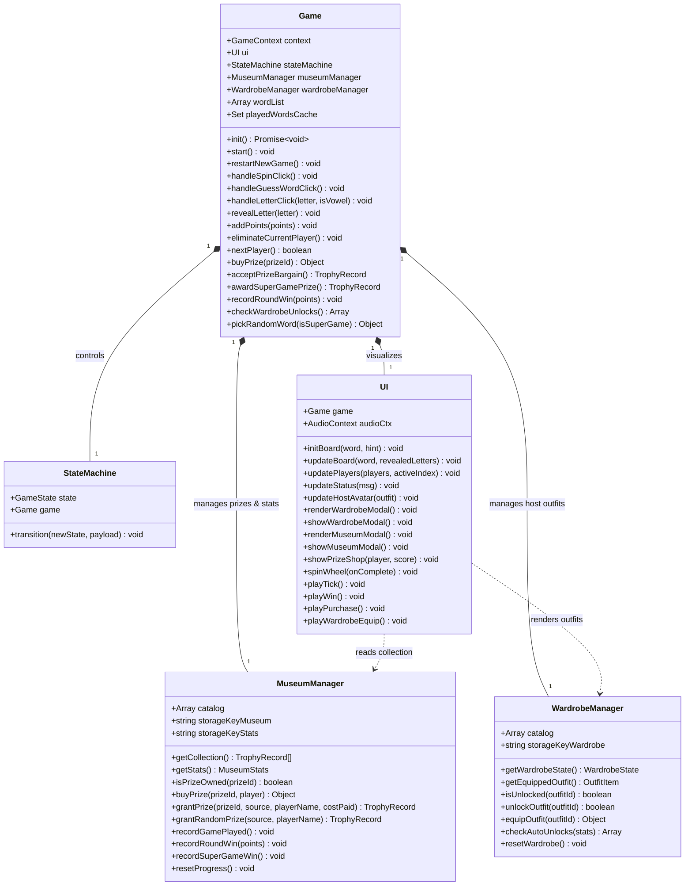
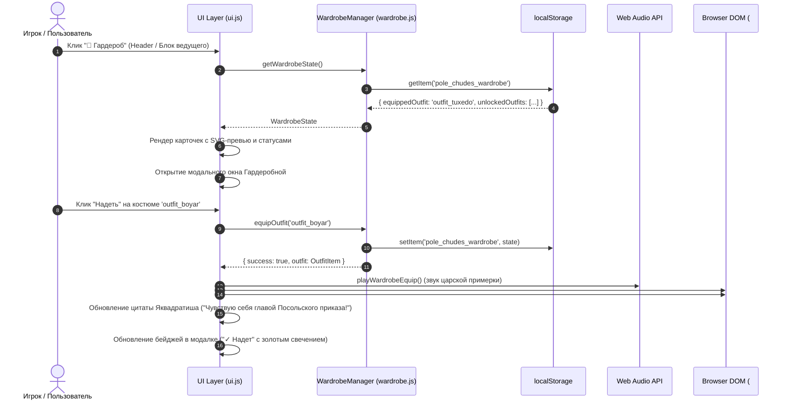
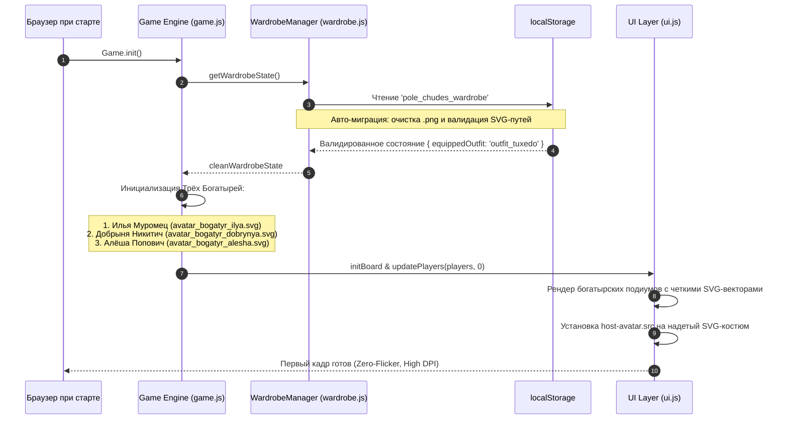
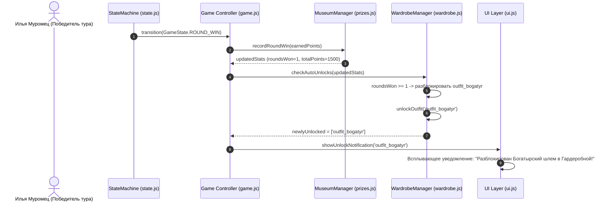

# System Design: Капитал-шоу "Поле Чудес: Premium Edition"
**Version:** v9.1.0 (Authentic Vector Avatars, Visual Wardrobe Transformation & Russian Header Edition)  
**Mode:** Compact Mode (Hot-Seat Multiplayer + Persistent Meta-Progression + Wardrobe Customization + Cloud Native)  
**Author:** System Architect (MetaGPT Pipeline)  
**Target Platform:** Pure HTML5 / CSS3 / ES6+ Modules + Google Cloud Run (Containerized Nginx Alpine)  

---

## 1. Implementation Approach & Architectural Philosophy

Проект реализуется в формате **Clean Room Enterprise SPA & Cloud Native Micro-Service**. Архитектура версии **v9.1.0** всецело ориентирована на обеспечение **100% визуальной аутентичности и масштабируемости графики (Clean Room Vector Graphics)**, полное устранение диссонанса между нарративом и графикой, а также реализацию **динамического реактивного преображения ведущего (Leonid Yakvadratish Dynamic Visual Wardrobe)** в реальном времени.

### 1.1 Архитектурные столпы релиза v9.1.0

```
+---------------------------------------------------------------------------------------+
|                                    Google Cloud Run                                   |
|  +---------------------------------------------------------------------------------+  |
|  |                  Nginx Alpine Web Server (Dynamic $PORT via envsubst)           |  |
|  |  - Gzip (text/css, app/js, image/svg+xml)  - ES6 Strict MIME Types              |  |
|  |  - SPA Routing Fallback                    - /healthz Endpoint (v9.1.0)         |  |
|  |  - Immutable Asset Caching                 - Security & Isolation Headers       |  |
|  +---------------------------------------------------------------------------------+  |
+-------------------------------------------+-------------------------------------------+
                                            | (HTTP/2, HTTPS)
                                            v
+---------------------------------------------------------------------------------------+
|                                  Browser Client (SPA)                                 |
|                                                                                       |
|  +--------------------------------+   +---------------------------------------------+ |
|  |       Presentation Layer       |   |              Core Game Engine               | |
|  |  - Russian Header & Branding   |   |  - Game Controller (game.js)                | |
|  |  - Reactive Host Transformation|   |  - State Machine (state.js, 20 States)      | |
|  |  - Glassmorphism Studio UI     |   |  - Dictionary & Round Cache Engine          | |
|  |  - Web Audio Sound Synthesizer |   |  - Migration & Validation Engine            | |
|  |  - Modal Manager & Animations  |   +---------------------------------------------+ |
|  +--------------------------------+                          ^                        |
|                  ^                                           |                        |
|                  +---------------------+---------------------+                        |
|                                        v                                              |
|  +---------------------------------------------------------------------------------+  |
|  |                   Clean Room SVG Vector Graphics Engine                         |  |
|  |  - 3 Bogatyrs Vectors: ilya.svg, dobrynya.svg, alesha.svg (viewBox 0 0 120 120) |  |
|  |  - 5 Yakvadratish Outfits: tuxedo, bogatyr, boyar, folk, cosmonaut (.svg)       |  |
|  +---------------------------------------------------------------------------------+  |
|                                        ^                                              |
|                                        v                                              |
|  +---------------------------------------------------------------------------------+  |
|  |                      Persistent Meta-Progression Services                       |  |
|  |  - MuseumManager (prizes.js): 16 Folklore Prizes, Stats, Trophy Collection      |  |
|  |  - WardrobeManager (wardrobe.js): 5 SVG Outfits, Auto-Unlocks, Dynamic Equipping|  |
|  |  - LocalStorage Engine: 'pole_chudes_museum', 'pole_chudes_wardrobe' (Cleaned)  |  |
|  +---------------------------------------------------------------------------------+  |
+---------------------------------------------------------------------------------------+
```

1. **Russian Header & Authentic Branding:**
   - Фирменный главный заголовок студии: `⭐ Капитал-шоу Поле Чудес`.
   - Подзаголовок и бейдж издания: `«Леонид Яквадратиш и Три Богатыря» v9.1.0`.
   - Панель управления с кнопками быстрого доступа к мета-системам: `🏛️ Музей`, `👔 Гардероб`.

2. **100% Clean Room SVG Vector Engine:**
   - Полная ликвидация растровых изображений сторонней интеллектуальной собственности (`avatar_harry.png`, `avatar_hermione.png`, `avatar_ron.png`, `avatar_yakubovich.png`).
   - Разработка 8 оригинальных чистых векторных SVG-иллюстраций высокого разрешения:
     * **3 Былинных богатыря:** Илья Муромец (`avatar_bogatyr_ilya.svg`), Добрыня Никитич (`avatar_bogatyr_dobrynya.svg`), Алёша Попович (`avatar_bogatyr_alesha.svg`).
     * **5 Нарядов ведущего:** Классический смокинг (`avatar_yakvadratish_tuxedo.svg`), Богатырский шлем (`avatar_yakvadratish_bogatyr.svg`), Боярский кафтан (`avatar_yakvadratish_boyar.svg`), Расшитый халат (`avatar_yakvadratish_folk.svg`), Шлем космонавта (`avatar_yakvadratish_cosmonaut.svg`).

3. **Dynamic Reactive Wardrobe Visual Binding:**
   - Внедрение сквозной реактивной модели связывания наряда ведущего: при клике «Надеть» в Гардеробной происходит синхронное обновление DOM-элемента `#host-avatar`, модальных превью и реплик ведущего с запуском физической CSS-микроанимации `avatar-transform-flash` (`avatarPop`).
   - Автоматическая валидация и миграция устаревших растровых путей (`.png`) в `localStorage` к актуальным SVG-идентификаторам.

4. **Slavic Folklore & Retro Meta-Progression:**
   - Каталог из 16 предметов славянского фольклора и народных ремесел без нарушения чужих торговых марок.
   - Персистентное сохранение наград, надетых костюмов и статистики побед.

5. **Google Cloud Run Ready Architecture:**
   - Минималистичный Docker-контейнер `nginx:alpine` (< 30 МБ) с поддержкой динамического порта `$PORT`.
   - Оптимизированная отдача `image/svg+xml` со сжатием Gzip и строгими заголовками кэширования.
   - Эндпоинт проверки работоспособности `/healthz` возвращает `HTTP 200 OK` с версией `v9.1.0`.

---

## 2. Data Structures & Interface Definitions (TypeScript / ES6)

```typescript
// ========================================================
// 1. Общие типы редкости и источников
// ========================================================
export type RarityType = 'common' | 'rare' | 'epic' | 'legendary';

export type PrizeCategory = 
    | 'Памятное'
    | 'Угощения'
    | 'Посуда'
    | 'Традиции'
    | 'Музыка'
    | 'Уют'
    | 'Артефакты'
    | 'Вооружение'
    | 'Престиж'
    | 'Транспорт'
    | 'Зал Славы';

export type PrizeSource = 'shop' | 'prize_sector' | 'super_game';

// ========================================================
// 2. Структуры Каталога Призов (Folklore & Retro)
// ========================================================
export interface PrizeItem {
    id: string;               // 'prize_pickles', 'prize_horse', etc.
    name: string;             // Былинное наименование
    rarity: RarityType;       // Градация ценности
    price: number;            // Стоимость в очках
    icon: string;             // Символ/эмодзи экспоната ('🍄', '🐎', '🪕')
    description: string;      // Атмосферное описание
    category: PrizeCategory;  // Категория экспоната
    sourcePool: PrizeSource[];// Способы получения
}

export interface TrophyRecord {
    id: string;               // UUID записи (`${prizeId}_${timestamp}`)
    prizeId: string;          // Внешний ключ на PrizeItem.id
    unlockedAt: string;       // ISO дата получения
    costPaid: number;         // Уплаченные очки
    source: PrizeSource;      // Источник получения
    playerName: string;       // Имя богатыря, добавившего экспонат
}

export interface MuseumStats {
    gamesPlayed: number;        // Всего сыграно игр
    roundsWon: number;          // Побед в основных турах
    superGameWins: number;      // Побед в супер-играх
    totalPointsEarned: number;  // Суммарно набрано очков за историю профиля
    prizesCollected: number;    // Количество уникальных собранных экспонатов
}

// ========================================================
// 3. Структуры Гардеробной Леонида Яквадратиша
// ========================================================
export type UnlockConditionType = 
    | 'default'          // Доступен сразу
    | 'round_win'        // Победа в туре (>= threshold)
    | 'museum_count'     // Экспонатов в Музее (>= threshold)
    | 'total_points'     // Суммарно очков (>= threshold)
    | 'super_game_win';  // Победа в Супер-игре (>= threshold)

export interface OutfitItem {
    id: string;                      // 'outfit_tuxedo', 'outfit_bogatyr', etc.
    name: string;                    // Название наряда
    rarity: RarityType;              // Редкость наряда
    icon: string;                    // Эмодзи костюма ('🤵', '🛡️', '👑', '🪔', '🧑‍🚀')
    unlockConditionText: string;     // Текстовое описание условия для UI
    unlockType: UnlockConditionType; // Тип программного триггера
    unlockThreshold: number;         // Пороговое значение для разблокировки
    avatarSrc: string;               // Путь к SVG-файлу ('assets/avatar_yakvadratish_*.svg')
    quote: string;                   // Реплика Яквадратиша при примерке
    description: string;             // Художественное описание наряда
}

export interface WardrobeState {
    equippedOutfit: string;          // ID активного костюма ('outfit_tuxedo')
    unlockedOutfits: string[];       // Массив разблокированных ID
}

// ========================================================
// 4. Стейт-машина, игроки и контекст игры
// ========================================================
export enum GameState {
    INIT = 'INIT',
    NEXT_PLAYER_ANNOUNCE = 'NEXT_PLAYER_ANNOUNCE',
    WAITING_FOR_SPIN = 'WAITING_FOR_SPIN',
    SPINNING = 'SPINNING',
    EVALUATE_SECTOR = 'EVALUATE_SECTOR',
    WAITING_FOR_LETTER = 'WAITING_FOR_LETTER',
    WAITING_FOR_CELL = 'WAITING_FOR_CELL',
    PRIZE_BARGAIN = 'PRIZE_BARGAIN',
    GUESSING_WORD = 'GUESSING_WORD',
    CHECK_MATCH = 'CHECK_MATCH',
    PASSING_TURN = 'PASSING_TURN',
    CHECK_WIN = 'CHECK_WIN',
    ROUND_WIN = 'ROUND_WIN',
    CASKET_GAME = 'CASKET_GAME',
    SUPER_GAME_OFFER = 'SUPER_GAME_OFFER',
    SUPER_GAME_SETUP = 'SUPER_GAME_SETUP',
    SUPER_GAME_PLAYING = 'SUPER_GAME_PLAYING',
    SUPER_GAME_WIN = 'SUPER_GAME_WIN',
    PRIZE_SHOP = 'PRIZE_SHOP',
    GAME_OVER = 'GAME_OVER'
}

export enum SectorType {
    POINTS = 'POINTS',
    BANKRUPT = 'BANKRUPT',
    ZERO = 'ZERO',
    PLUS = 'PLUS',
    PRIZE = 'PRIZE'
}

export interface Player {
    id: number;
    name: string;       // 'Илья Муромец', 'Добрыня Никитич', 'Алёша Попович'
    title: string;      // 'Старший богатырь', 'Богатырь-дипломат', 'Младший богатырь'
    avatar: string;     // SVG-ассет ('assets/avatar_bogatyr_*.svg')
    score: number;      // Очки текущего раунда
    isEliminated: boolean;
}

export interface GameContext {
    players: Player[];
    activePlayerIndex: number;
    secretWord: string;
    hint: string;
    revealedLetters: Set<string>;
    currentSectorValue: string | number;
    consecutiveGuesses: number;
    isSuperGame: boolean;
    superGameSetupLettersLeft: number;
    superGameTimer: ReturnType<typeof setInterval> | null;
    playedWordsCache: Set<string>;
}

// ========================================================
// 5. Интерфейсы Менеджеров и Контроллеров
// ========================================================
export interface IMuseumManager {
    readonly catalog: PrizeItem[];
    getCollection(): TrophyRecord[];
    getStats(): MuseumStats;
    isPrizeOwned(prizeId: string): boolean;
    buyPrize(prizeId: string, player: Player): { success: boolean; error?: string; trophy?: TrophyRecord };
    grantPrize(prizeId: string, source: PrizeSource, playerName: string, costPaid?: number): TrophyRecord;
    grantRandomPrize(source: PrizeSource, playerName: string): TrophyRecord;
    recordGamePlayed(): void;
    recordRoundWin(points: number): void;
    recordSuperGameWin(): void;
    resetProgress(): void;
}

export interface IWardrobeManager {
    readonly catalog: OutfitItem[];
    getWardrobeState(): WardrobeState;
    getEquippedOutfit(): OutfitItem;
    isUnlocked(outfitId: string): boolean;
    unlockOutfit(outfitId: string): boolean;
    equipOutfit(outfitId: string): { success: boolean; outfit?: OutfitItem; error?: string };
    checkAutoUnlocks(stats: MuseumStats): string[];
    resetWardrobe(): void;
}
```

---

## 3. Clean Room SVG Vector Specifications & Asset Catalogs

### 3.1 Стандарт проектирования векторных SVG-ассетов (SVG Standards)
1. **Единая координатная сетка:** `viewBox="0 0 120 120"`, `width="100%"`, `height="100%"`.
2. **Семантическая послойная структура:**
   - Слой 1: Фон / ореол (Circle / Linear/Radial Gradient).
   - Слой 2: Тело и наряд (Кольчуга, смокинг, кафтан, халат, скафандр).
   - Слой 3: Голова, лицо, глаза, прическа.
   - Слой 4: Фирменные атрибуты (Усы, шлемы, головные уборы, соболья оторочка, микрофон, гермошлем).
   - Слой 5: Светотень и блики (Highlights, Drop Shadows).
3. **Совместимость с Glassmorphism:** Чистые векторные градиенты, полупрозрачные заливки, отсутствие тяжелых внешних растровых фильтров, микроскопический размер (< 10 КБ на ассет).

---

### 3.2 Спецификация векторных аватаров Трёх Богатырей

| Файл ассета | Персонаж & Роль | Визуальное описание и ключевые элементы SVG | Палитра & Градиенты |
|---|---|---|---|
| `assets/avatar_bogatyr_ilya.svg` | **Илья Муромец**<br>*(Старший богатырь)* | Кованый стальной шелом с заостренным верхом и кольчужной бармицей, чешуйчатая кольчужная броня, массивная окладистая седая борода, мудрый непоколебимый взгляд, массивный стальной щит за плечом. | Сталь (`#718096` -> `#2d3748`), Золото (`#d69e2e`), Седина (`#e2e8f0`), Фон (`#1a365d` глубокий индиго). |
| `assets/avatar_bogatyr_dobrynya.svg` | **Добрыня Никитич**<br>*(Богатырь-дипломат)* | Золоченый княжеский шлем с филигранной чеканкой, алый бархатный плащ с золотой фибулой, аккуратные русые усы и ухоженная бородка, открытый благородный и дипломатичный взгляд. | Золото (`#ecc94b` -> `#b7791f`), Рубин (`#9b2c2c` -> `#c53030`), Русый (`#744210`), Фон (`#22543d` изумрудный). |
| `assets/avatar_bogatyr_alesha.svg` | **Алёша Попович**<br>*(Младший богатырь)* | Легкий кожано-металлический шлем лучника с наушами, задорный соломенный чуб, молодая открытая улыбка, соколиный зоркий прищур, колчан со стрелами за спиной. | Бронза (`#dd6b20`), Кожа (`#805ad5` / `#7b341e`), Золотистый чуб (`#f6e05e`), Фон (`#553c9a` аметистовый). |

---

### 3.3 Спецификация 5 SVG-костюмов Гардеробной Леонида Яквадратиша

| ID Костюма | Файл ассета | Название наряда | Редкость | Условие открытия | Визуальная спецификация SVG |
|---|---|---|---|---|---|
| `outfit_tuxedo` | `assets/avatar_yakvadratish_tuxedo.svg` | Классический смокинг | `common` | Доступен сразу (`default`) | Элегантный черный фрак с шелковыми лацканами, галстук-бабочка, белоснежная манишка, фирменный ретро-микрофон в руке, пышные харизматичные черные усы и озорной прищур. |
| `outfit_bogatyr` | `assets/avatar_yakvadratish_bogatyr.svg` | Богатырский шлем и кольчуга | `rare` | Выиграть 1 тур (`round_win >= 1`) | Стальной островерхий былинный шлем с наносником, кольчужная рубаха с золотыми заклепками, задорно топорщащиеся из-под шлема фирменные усы. |
| `outfit_boyar` | `assets/avatar_yakvadratish_boyar.svg` | Боярский кафтан и соболья шапка | `rare` | Собрать 4 экспоната в Музее (`museum_count >= 4`) | Высокая горлатная шапка из драгоценного соболя с золотой пряжкой, парчовый узорчатый кафтан с золотыми пуговицами-гирьками и стоячим воротником-козырем. |
| `outfit_folk_robe` | `assets/avatar_yakvadratish_folk.svg` | Расшитый халат и тюбетейка | `epic` | Набрать 7500 очков (`total_points >= 7500`) | Бархатная тюбетейка с тончайшей золотой вышивкой, разноцветный шелковый халат с традиционным восточным орнаментом и пиала с чаем. |
| `outfit_cosmonaut` | `assets/avatar_yakvadratish_cosmonaut.svg` | Шлем космонавта | `legendary` | Победить в Супер-игре (`super_game_win >= 1`) | Футуристический гермошлем с зеркальным золотистым забралом (отражающим звезды), световые индикаторы, белый скафандр с ретро-воротником. |

---

### 3.4 Славянско-фольклорный каталог призов (`PRIZES_CATALOG`)

```javascript
export const PRIZES_CATALOG = [
  { id: 'prize_postcard', name: 'Фирменная открытка от Яквадратиша', rarity: 'common', price: 0, category: 'Памятное', icon: '✉️', description: 'Красочная открытка с теплой дарственной надписью и улыбкой Леонида Яквадратиша.', sourcePool: ['shop', 'prize_sector'] },
  { id: 'prize_pickles', name: 'Банка соленых рыжиков', rarity: 'common', price: 100, category: 'Угощения', icon: '🍄', description: 'Хрустящие лесные рыжики в пряном рассоле с укропом и чесночком по старинному рецепту.', sourcePool: ['shop', 'prize_sector'] },
  { id: 'prize_tea', name: 'Пачка душистого иван-чая', rarity: 'common', price: 250, category: 'Угощения', icon: '🫖', description: 'Отборный ферментированный кипрей с таежными ягодами. Богатырское здоровье в каждой чашке!', sourcePool: ['shop', 'prize_sector'] },
  { id: 'prize_pryanik', name: 'Тульский пряник-великан', rarity: 'common', price: 500, category: 'Угощения', icon: '🥮', description: 'Печатный медовый пряник с яблочным повидлом весом в целый пуд!', sourcePool: ['shop', 'prize_sector'] },
  { id: 'prize_glasses', name: 'Набор хрустальных кубков', rarity: 'rare', price: 750, category: 'Посуда', icon: '🥂', description: 'Звонкие граненые кубки для ключевой воды и праздничного кваса.', sourcePool: ['shop', 'prize_sector'] },
  { id: 'prize_samovar', name: 'Расписной электросамовар', rarity: 'rare', price: 1000, category: 'Традиции', icon: '🫖', description: 'Золоченый тульский самовар с хохломской росписью. Душа любой богатырской беседы.', sourcePool: ['shop', 'prize_sector'] },
  { id: 'prize_gusli', name: 'Гусли-самогуды', rarity: 'rare', price: 1500, category: 'Музыка', icon: '🪕', description: 'Звончатые яровчатые гусли: сами играют, сами плясать заставляют!', sourcePool: ['shop', 'prize_sector'] },
  { id: 'prize_carpet', name: 'Настенный ковер со сказочными оленями', rarity: 'rare', price: 2000, category: 'Уют', icon: '🧶', description: 'Теплый шерстяной ковер с пушистым ворсом для богатырской опочивальни.', sourcePool: ['shop', 'prize_sector'] },
  { id: 'prize_boots', name: 'Сапоги-скороходы сафьяновые', rarity: 'epic', price: 2500, category: 'Артефакты', icon: '👢', description: 'Сафьяновые сапоги на мягком ходу: шаг шагнул — семь верст отмерил!', sourcePool: ['shop', 'prize_sector'] },
  { id: 'prize_feather', name: 'Перо Жар-птицы сияющее', rarity: 'epic', price: 3500, category: 'Артефакты', icon: '🪶', description: 'Волшебное перо, освещающее даже самую темную ночь ярче тысячи свечей.', sourcePool: ['shop', 'prize_sector'] },
  { id: 'prize_tablecloth', name: 'Скатерть-самобранка шелковая', rarity: 'epic', price: 5000, category: 'Артефакты', icon: '📜', description: 'Стоит расстелить — и на столе яства сахарные, пироги пышные да напитки медвяные!', sourcePool: ['shop', 'prize_sector'] },
  { id: 'prize_sword', name: 'Меч-кладенец булатный', rarity: 'epic', price: 7000, category: 'Вооружение', icon: '⚔️', description: 'Кованый булатный клинок работы древних мастеров, сокрушающий любые преграды.', sourcePool: ['shop', 'prize_sector'] },
  { id: 'prize_fur_coat', name: 'Соболья шуба до пят', rarity: 'epic', price: 9000, category: 'Престиж', icon: '🧥', description: 'Бархатная шуба на отборных сибирских соболях. Подарок достойный великих князей!', sourcePool: ['shop', 'prize_sector'] },
  { id: 'prize_horse', name: 'Богатырский конь Бурушка', rarity: 'legendary', price: 15000, category: 'Транспорт', icon: '🐎', description: 'Верный былинный скакун: из копыт искры сыплются, ветру в поле не угнаться!', sourcePool: ['shop', 'prize_sector', 'super_game'] },
  { id: 'prize_carpet_plane', name: 'Сказочный Ковер-самолет', rarity: 'legendary', price: 25000, category: 'Транспорт', icon: '🛸', description: 'Роскошный ковер ручной вязки для беспосадочных полетов над тридевятым царством.', sourcePool: ['shop', 'super_game'] },
  { id: 'prize_gold_cup', name: 'Золотая Медаль Леонида Яквадратиша', rarity: 'legendary', price: 30000, category: 'Зал Славы', icon: '🏅', description: 'Высшая награда Капитал-шоу из чистого золота для истинных чемпионов народной эрудиции.', sourcePool: ['shop', 'super_game'] }
];
```

---

## 4. Dynamic Wardrobe Visual Binding & UI Architecture

### 4.1 Архитектура реактивного преображения ведущего

```
                                Wardrobe Customization Pipeline
                                
  +---------------------------------------------------------------------------------------+
  | 1. User Interaction: Click "[ Надеть ]" in modal-wardrobe                             |
  +---------------------------------------------------------------------------------------+
                                             |
                                             v
  +---------------------------------------------------------------------------------------+
  | 2. WardrobeManager.equipOutfit(outfitId):                                             |
  |    - Validates outfit is unlocked                                                     |
  |    - Updates equippedOutfit state                                                     |
  |    - Writes clean payload to localStorage['pole_chudes_wardrobe']                     |
  |    - Returns OutfitItem with avatarSrc ('assets/avatar_yakvadratish_*.svg')           |
  +---------------------------------------------------------------------------------------+
                                             |
                                             v
  +---------------------------------------------------------------------------------------+
  | 3. UI Controller Reactive Dispatch:                                                   |
  |    - UI.updateHostAvatar(outfit)                                                      |
  |    - Audio.playWardrobeEquip() (rich fitting audio feedback)                          |
  |    - DOM Mutation: hostAvatarImg.src = outfit.avatarSrc                               |
  |    - CSS Animation: hostAvatarImg.classList.add('avatar-transform-flash')             |
  |    - Updates Host Dialogue Bubble with outfit.quote                                   |
  |    - Re-renders Wardrobe Modal cards ('[ ✓ Надет ]' badge with neon glow)             |
  +---------------------------------------------------------------------------------------+
```

### 4.2 Спецификация CSS-микроанимации трансформации (`avatar-transform-flash`)

```css
/* Плавный переход и вспышка преображения аватара ведущего */
.host-avatar-img {
    width: 90px;
    height: 90px;
    border-radius: 50%;
    border: 3px solid rgba(255, 215, 0, 0.6);
    box-shadow: 0 0 20px rgba(255, 215, 0, 0.3);
    object-fit: cover;
    transition: transform 0.3s cubic-bezier(0.34, 1.56, 0.64, 1), filter 0.3s ease;
}

.avatar-transform-flash {
    animation: avatarPop 0.45s cubic-bezier(0.34, 1.56, 0.64, 1) forwards;
}

@keyframes avatarPop {
    0% {
        transform: scale(0.8) rotate(-6deg);
        filter: brightness(2) drop-shadow(0 0 25px #ffd700);
    }
    50% {
        transform: scale(1.18) rotate(4deg);
        filter: brightness(1.4) drop-shadow(0 0 15px #ffd700);
    }
    100% {
        transform: scale(1) rotate(0deg);
        filter: brightness(1) drop-shadow(0 0 10px rgba(255, 215, 0, 0.4));
    }
}
```

### 4.3 Спецификация миграции устаревшего кэша хранилища (`WardrobeManager.getWardrobeState()`)

Для исключения ошибок 404 и битых картинок у пользователей с данными предыдущих версий в `wardrobe.js` закладывается алгоритм авто-нормализации:

```javascript
getWardrobeState() {
    try {
        const raw = localStorage.getItem(this.storageKey);
        if (!raw) return this.getDefaultState();
        
        const parsed = JSON.parse(raw);
        let equipped = parsed.equippedOutfit;
        
        // Автомиграция: если сохранился старый ID или растровый путь
        const validOutfitIds = this.catalog.map(o => o.id);
        if (!validOutfitIds.includes(equipped)) {
            equipped = 'outfit_tuxedo';
        }
        
        const unlocked = Array.isArray(parsed.unlockedOutfits) 
            ? parsed.unlockedOutfits.filter(id => validOutfitIds.includes(id))
            : ['outfit_tuxedo'];
            
        if (!unlocked.includes('outfit_tuxedo')) {
            unlocked.push('outfit_tuxedo');
        }
        
        const cleanState = { equippedOutfit: equipped, unlockedOutfits: unlocked };
        localStorage.setItem(this.storageKey, JSON.stringify(cleanState));
        return cleanState;
    } catch (e) {
        console.warn('Wardrobe state parse error, falling back to default:', e);
        return this.getDefaultState();
    }
}
```

---

## 5. Google Cloud Run Deployment & Container Architecture

### 5.1 Топология и доставка векторных ассетов

```
                                 Google Cloud Platform
                        +---------------------------------------+
                        |           Google Cloud Run            |
                        |                                       |
    HTTPS User Traffic  |    +-----------------------------+    |
    ------------------->|--->|   Container: Nginx Alpine   |    |
    (Port 443 / SSL)    |    |   - Listening on $PORT      |    |
                        |    |   - Static SPA assets & SVGs|    |
                        |    |   - Gzip (image/svg+xml)    |    |
                        |    |   - /healthz -> 200 OK      |    |
                        |    +-----------------------------+    |
                        +---------------------------------------+
```

### 5.2 Спецификация `Dockerfile`

```dockerfile
# -------------------------------------------------------------
# Google Cloud Run Optimized Dockerfile (v9.1.0)
# Base: nginx:alpine (lightweight, secure, < 30MB)
# -------------------------------------------------------------
FROM nginx:alpine

WORKDIR /usr/share/nginx/html

# Clean default assets
RUN rm -rf ./*

# Copy clean web application assets (including pure SVG vectors)
COPY src/ .

# Copy Nginx template for dynamic $PORT substitution by envsubst
COPY nginx.conf.template /etc/nginx/templates/default.conf.template

ENV PORT=8080
EXPOSE 8080

HEALTHCHECK --interval=30s --timeout=3s --start-period=2s --retries=3 \
  CMD wget --quiet --tries=1 --spider http://127.0.0.1:${PORT}/healthz || exit 1

CMD ["nginx", "-g", "daemon off;"]
```

### 5.3 Спецификация `nginx.conf.template`

```nginx
server {
    listen ${PORT};
    server_name localhost;

    root /usr/share/nginx/html;
    index index.html;

    # Gzip Compression Optimization (включая SVG векторы)
    gzip on;
    gzip_vary on;
    gzip_min_length 256;
    gzip_proxied any;
    gzip_types
        text/plain
        text/css
        text/javascript
        application/javascript
        application/json
        application/xml
        image/svg+xml;

    # Security Headers
    add_header X-Frame-Options "SAMEORIGIN" always;
    add_header X-Content-Type-Options "nosniff" always;
    add_header X-XSS-Protection "1; mode=block" always;
    add_header Referrer-Policy "strict-origin-when-cross-origin" always;

    # Healthcheck Endpoint for Cloud Run Probes
    location = /healthz {
        access_log off;
        default_type application/json;
        return 200 '{"status":"healthy","version":"v9.1.0"}';
    }

    # Static Assets Caching & Correct MIME types
    location ~* \.(js|mjs)$ {
        types {
            application/javascript js mjs;
        }
        add_header Content-Type application/javascript;
        add_header Cache-Control "public, max-age=31536000, immutable";
        try_files $uri =404;
    }

    location ~* \.(css|svg|png|jpg|jpeg|gif|ico|json)$ {
        add_header Cache-Control "public, max-age=31536000, immutable";
        try_files $uri =404;
    }

    # SPA Fallback for index.html
    location / {
        add_header Cache-Control "no-cache, no-store, must-revalidate";
        try_files $uri $uri/ /index.html;
    }
}
```

---

## 6. Class Diagram (Mermaid)



---

## 7. Sequence Diagrams

### 7.1 Dynamic Wardrobe Transformation & Reactive SVG Visual Binding



---

### 7.2 Three Bogatyrs Player Resolution & Startup Cache Migration



---

### 7.3 Google Cloud Run Startup & Health Probe Execution (v9.1.0)

```mermaid
sequenceDiagram
    autonumber
    participant CloudRun as Google Cloud Run Fabric
    participant Entrypoint as Container Entrypoint (envsubst)
    participant Nginx as Nginx Alpine Daemon
    participant Probe as Cloud Run Health Checker
    actor User as Браузер пользователя

    CloudRun->>Entrypoint: Запуск контейнера (ENV: PORT=8080)
    Entrypoint->>Entrypoint: envsubst < default.conf.template > default.conf
    Entrypoint->>Nginx: nginx -g "daemon off;"
    Nginx-->>CloudRun: Порт 8080 слушает входящие запросы

    CloudRun->>Probe: Health Check Probe
    Probe->>Nginx: GET http://localhost:8080/healthz
    Nginx-->>Probe: HTTP 200 OK {"status":"healthy","version":"v9.1.0"}
    Probe-->>CloudRun: Revision Status: READY (100% Traffic Routed)

    User->>Nginx: HTTPS GET /
    Nginx-->>User: HTTP 200 (index.html, JS Modules, SVG Vectors with Gzip)
```

---

### 7.4 Auto-Unlock Costumes upon Round Win & Meta-Progression



---

## 8. Deprecation & Asset Cleanup Plan

Для обеспечения 100% юридической чистоты и оптимизации размера контейнера растровые файлы устаревших персонажей подлежат полному удалению:

| Удаляемый файл | Причина удаления | Заменяющий ассет v9.1.0 |
|---|---|---|
| `src/assets/avatar_harry.png` | Ликвидация сторонней IP / Растровый артефакт | `src/assets/avatar_bogatyr_ilya.svg` |
| `src/assets/avatar_hermione.png` | Ликвидация сторонней IP / Растровый артефакт | `src/assets/avatar_bogatyr_dobrynya.svg` |
| `src/assets/avatar_ron.png` | Ликвидация сторонней IP / Растровый артефакт | `src/assets/avatar_bogatyr_alesha.svg` |
| `src/assets/avatar_yakubovich.png` | Ликвидация растрового портрета стороннего лица | `src/assets/avatar_yakvadratish_tuxedo.svg` (и 4 других SVG-костюма) |

---

## 9. Strict File List & Change Plan (v9.1.0)

| Файл | Назначение | Характер изменений в v9.1.0 |
|---|---|---|
| [`src/assets/avatar_bogatyr_ilya.svg`](file:///workspaces/antigravity20/5_MetaGPT/projects/pole_chudes_capital/src/assets/avatar_bogatyr_ilya.svg) | Аватар Ильи Муромца | **Новый файл:** Векторный SVG (стальной шлем, кольчуга, борода, мудрый взгляд). |
| [`src/assets/avatar_bogatyr_dobrynya.svg`](file:///workspaces/antigravity20/5_MetaGPT/projects/pole_chudes_capital/src/assets/avatar_bogatyr_dobrynya.svg) | Аватар Добрыни Никитича | **Новый файл:** Векторный SVG (золоченый шлем, княжеский плащ, русые усы). |
| [`src/assets/avatar_bogatyr_alesha.svg`](file:///workspaces/antigravity20/5_MetaGPT/projects/pole_chudes_capital/src/assets/avatar_bogatyr_alesha.svg) | Аватар Алёши Поповича | **Новый файл:** Векторный SVG (шлем лучника, чуб, задорная улыбка). |
| [`src/assets/avatar_yakvadratish_tuxedo.svg`](file:///workspaces/antigravity20/5_MetaGPT/projects/pole_chudes_capital/src/assets/avatar_yakvadratish_tuxedo.svg) | Костюм: Смокинг | **Новый файл:** Векторный SVG (черный смокинг, бабочка, микрофон, усы). |
| [`src/assets/avatar_yakvadratish_bogatyr.svg`](file:///workspaces/antigravity20/5_MetaGPT/projects/pole_chudes_capital/src/assets/avatar_yakvadratish_bogatyr.svg) | Костюм: Богатырь | **Новый файл:** Векторный SVG (островерхий шлем, кольчуга, усы). |
| [`src/assets/avatar_yakvadratish_boyar.svg`](file:///workspaces/antigravity20/5_MetaGPT/projects/pole_chudes_capital/src/assets/avatar_yakvadratish_boyar.svg) | Костюм: Боярин | **Новый файл:** Векторный SVG (высокая соболья шапка, парчовый кафтан). |
| [`src/assets/avatar_yakvadratish_folk.svg`](file:///workspaces/antigravity20/5_MetaGPT/projects/pole_chudes_capital/src/assets/avatar_yakvadratish_folk.svg) | Костюм: Халат | **Новый файл:** Векторный SVG (вышитая тюбетейка, восточный шелковый халат). |
| [`src/assets/avatar_yakvadratish_cosmonaut.svg`](file:///workspaces/antigravity20/5_MetaGPT/projects/pole_chudes_capital/src/assets/avatar_yakvadratish_cosmonaut.svg) | Костюм: Космонавт | **Новый файл:** Векторный SVG (гермошлем с золотым забралом, скафандр). |
| [`src/index.html`](file:///workspaces/antigravity20/5_MetaGPT/projects/pole_chudes_capital/src/index.html) | Главная страница SPA | Заголовок `⭐ Капитал-шоу Поле Чудес`, бейдж `v9.1.0`, SVG-аватар `#host-avatar`, скрипты `?v=9.1.0`. |
| [`src/style.css`](file:///workspaces/antigravity20/5_MetaGPT/projects/pole_chudes_capital/src/style.css) | Стили интерфейса | CSS-анимация `avatar-transform-flash` (`avatarPop`), стили для SVG-подиумов. |
| [`src/js/wardrobe.js`](file:///workspaces/antigravity20/5_MetaGPT/projects/pole_chudes_capital/src/js/wardrobe.js) | Гардероб ведущего | Каталог `YAKVADRATISH_WARDROBE` со связями к SVG, авто-миграция кэша в `getWardrobeState()`. |
| [`src/js/game.js`](file:///workspaces/antigravity20/5_MetaGPT/projects/pole_chudes_capital/src/js/game.js) | Ядро игры | Инициализация Трёх Богатырей с SVG-путями, связывание смены аватара. |
| [`src/js/ui.js`](file:///workspaces/antigravity20/5_MetaGPT/projects/pole_chudes_capital/src/js/ui.js) | Слой представления | `updateHostAvatar()` с реактивной подменой `.src` и классом `avatar-transform-flash`. |
| [`src/js/main.js`](file:///workspaces/antigravity20/5_MetaGPT/projects/pole_chudes_capital/src/js/main.js) | Точка входа | Версионирование `v9.1.0`, инициализация гардероба при старте. |
| [`nginx.conf.template`](file:///workspaces/antigravity20/5_MetaGPT/projects/pole_chudes_capital/nginx.conf.template) | Шаблон Nginx | Версия `/healthz` -> `v9.1.0`, Gzip для `image/svg+xml`. |
| [`tests/game.test.js`](file:///workspaces/antigravity20/5_MetaGPT/projects/pole_chudes_capital/tests/game.test.js) | Unit-тесты | Тесты валидности SVG-путей гардероба, богатырей, миграции кэша. |
| [`tests/e2e_browser_test.py`](file:///workspaces/antigravity20/5_MetaGPT/projects/pole_chudes_capital/tests/e2e_browser_test.py) | E2E Marionette тесты | Браузерные тесты реактивной смены костюма ведущего, рендера богатырей и отсутствия 404. |

---

## 10. Implementation Roadmap

```
                                  v9.1.0 Implementation Timeline
  +-----------------------------------------------------------------------------------------------+
  | Phase 1: Clean Room SVG Vector Asset Creation (3 Bogatyrs + 5 Yakvadratish Outfits)           |
  +-----------------------------------------------------------------------------------------------+
                                                 |
                                                 v
  +-----------------------------------------------------------------------------------------------+
  | Phase 2: Dynamic Visual Binding & Animation (wardrobe.js, ui.js, style.css, index.html)       |
  +-----------------------------------------------------------------------------------------------+
                                                 |
                                                 v
  +-----------------------------------------------------------------------------------------------+
  | Phase 3: Legacy Cleanup & Cache Migration (Delete 4 PNGs, normalize localStorage)            |
  +-----------------------------------------------------------------------------------------------+
                                                 |
                                                 v
  +-----------------------------------------------------------------------------------------------+
  | Phase 4: Container & Health Probe Update (nginx.conf.template -> v9.1.0)                      |
  +-----------------------------------------------------------------------------------------------+
                                                 |
                                                 v
  +-----------------------------------------------------------------------------------------------+
  | Phase 5: Verification & Quality Assurance (Node.js Unit Tests + Python Marionette E2E)        |
  +-----------------------------------------------------------------------------------------------+
```

1. **Этап 1: Создание векторных ассетов (Clean Room SVG):**
   - Сгенерировать 3 аутентичных SVG-файла былинных богатырей в `src/assets/`.
   - Сгенерировать 5 аутентичных SVG-файлов костюмов Леонида Яквадратиша в `src/assets/`.
2. **Этап 2: Реактивное связывание и визуальное преображение:**
   - Обновить `wardrobe.js`: привязать каждый костюм к уникальному SVG, внедрить безопасную миграцию кэша.
   - Обновить `game.js`: привязать богатырей к новым SVG-аватарам.
   - Обновить `ui.js`: поддержать реактивную смену `#host-avatar`, вспышку `avatar-transform-flash` и звуковой эффект `playWardrobeEquip()`.
   - Добавить стили анимации в `style.css` и обновить заголовок студии в `index.html`.
3. **Этап 3: Зачистка устаревших PNG-ассетов:**
   - Удалить `avatar_harry.png`, `avatar_hermione.png`, `avatar_ron.png`, `avatar_yakubovich.png`.
4. **Этап 4: Обновление конфигурации и контейнеризации:**
   - Обновить `nginx.conf.template` для выдачи версии `v9.1.0` в `/healthz`.
5. **Этап 5: Верификация и регрессионное тестирование:**
   - Запустить модульные тесты `npm test` (`tests/game.test.js`).
   - Запустить браузерные тесты `python3 tests/e2e_browser_test.py`.
   - Проверить нулевое количество 404 ошибок и безупречную четкость векторной графики.

---
*Документ System Design v9.1.0 полностью сформирован и готов к передаче на шлюз Gate 1B (Architecture Review).*
