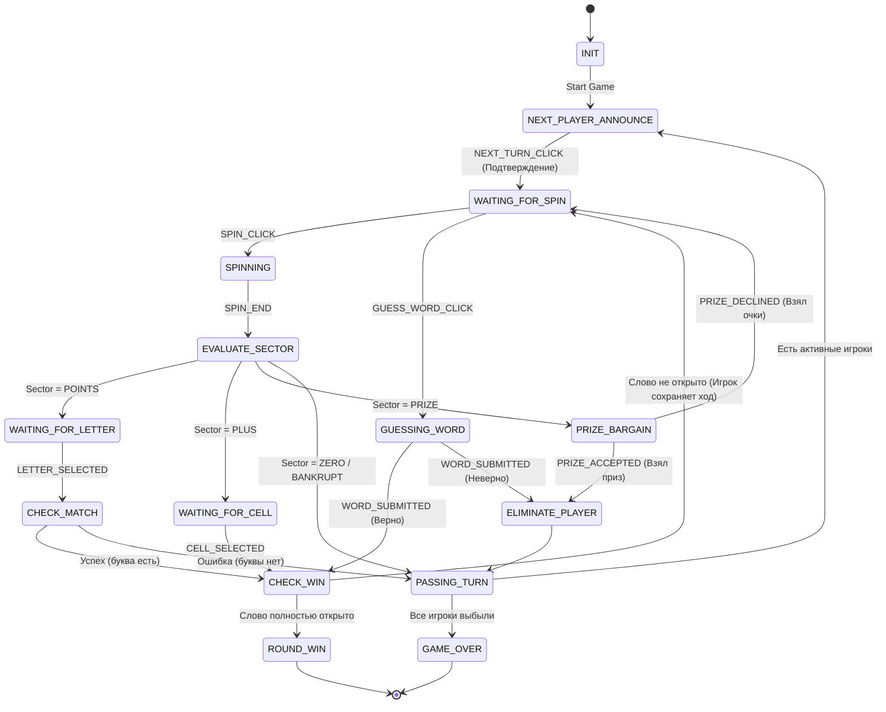
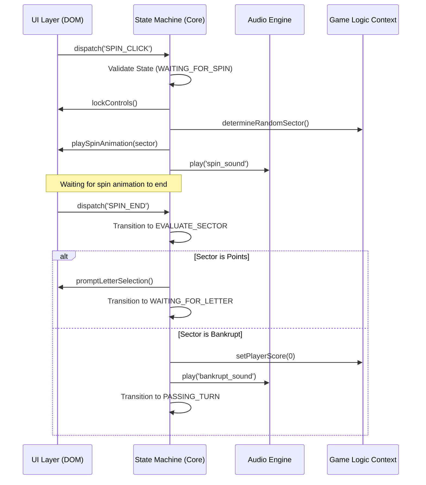

# System Design: Капитал-шоу "Поле Чудес: Premium Edition"

## 1. Implementation Approach
Проект реализуется в формате **Compact Mode (Hot-Seat Multiplayer)**. Поскольку игра предназначена для игры за одним экраном (локальный мультиплеер, передача хода), бэкенд не требуется.
Вся бизнес-логика и управление состоянием реализуются на **Pure HTML5, CSS3, JS ES6+ (Vanilla JS)**.
Для обеспечения Premium Visual Experience (Glassmorphism, микро-анимации) используются современные возможности CSS (backdrop-filter, CSS-переменные, transitions, keyframes).
Управление стейтом построено на базе строгого **конечного автомата (State Machine)**, что гарантирует защиту от гонки состояний (Race Conditions) и невалидных переходов. Компоненты UI взаимодействуют с логикой через событийную модель (CustomEvent), изолируя отображение от ядра игры.

## 2. Data Structures & Interface Definitions

```typescript
// Основные типы данных (Концептуальные)

enum GameState {
    INIT = 'INIT',
    NEXT_PLAYER_ANNOUNCE = 'NEXT_PLAYER_ANNOUNCE',
    WAITING_FOR_SPIN = 'WAITING_FOR_SPIN',
    SPINNING = 'SPINNING',
    EVALUATE_SECTOR = 'EVALUATE_SECTOR',
    WAITING_FOR_LETTER = 'WAITING_FOR_LETTER',
    WAITING_FOR_CELL = 'WAITING_FOR_CELL',
    PRIZE_BARGAIN = 'PRIZE_BARGAIN',
    GUESSING_WORD = 'GUESSING_WORD',
    PASSING_TURN = 'PASSING_TURN',
    CHECK_WIN = 'CHECK_WIN',
    ROUND_WIN = 'ROUND_WIN',
    GAME_OVER = 'GAME_OVER'
}

enum SectorType {
    POINTS = 'POINTS',
    BANKRUPT = 'BANKRUPT',
    ZERO = 'ZERO',
    PLUS = 'PLUS',
    PRIZE = 'PRIZE'
}

interface Player {
    id: number;
    name: string;
    score: number;
    isEliminated: boolean;
}

interface GameContext {
    players: Player[];
    activePlayerIndex: number;
    secretWord: string;
    revealedLetters: Set<string>;
    consecutiveGuesses: number; // Для мини-игры "две шкатулки"
    currentSector: SectorType | null;
}
```

## 3. State Machine Diagram



## 4. Program Call Flow / Component Interaction



## 5. Strict File List

*Вся директория исходников:* `src/` и `tests/`
Никакие другие файлы не должны создаваться.

- `src/index.html` - Главная разметка, подключение стилей и скриптов.
- `src/style.css` - Стили с использованием CSS-переменных, Glassmorphism, Animations.
- `src/js/main.js` - Точка входа, инициализация игры и привязка событий.
- `src/js/state.js` - Реализация строгой стейт-машины (Конечный автомат).
- `src/js/game.js` - Управление контекстом (Игроки, Очки, Табло слов).
- `src/js/ui.js` - Управление DOM, анимациями, модалками и рендером.
- `src/js/audio.js` - Менеджер звуков и эффектов.
- `tests/game.test.js` - Юнит-тесты логики контекста и стейт-машины (Node Test Runner).
- `package.json` - Описание скриптов запуска `npm start` (через `serve`) и `npm test`.
